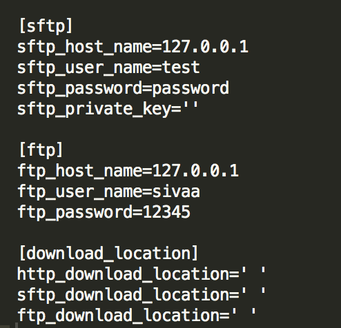

# file_downloader
Determines the protocal and filename from the urls and downloads file

# Protocals supported are:
 * Http
 * sftp
 * ftp

# Setup:
  * As the first step create ".credentials" folder inside configuration folder and create a file with name "houston.cfg" or set environment variable for the credentials path to the variable "credential_path"
  * Below shows the example of how it should look like, it should have credentials for sftp and ftp server you are trying download
  * You can also add download locations for each protocal or you can set environment variables in the same name.Makse sure its the same name as provided in the example image
  * you can run the script by passing single url or a file with urls (Assumes the file has only one column of urls) to download
  
  

# How to run:
To start the downloader, run `python initiator.py -url=' '` or `python initiator.py -file='path/to/input file'` or `python initiator.py -file='path/to/input file' -chunk_size=20`
* If the file is mentioned , then by default it takes 10 urls per chunk and downloads file parallely

# To add additional protocal:
* Add credentials if there is any to configuration file
* Add a file with respective protocal class and follow the namming convention for the function names
