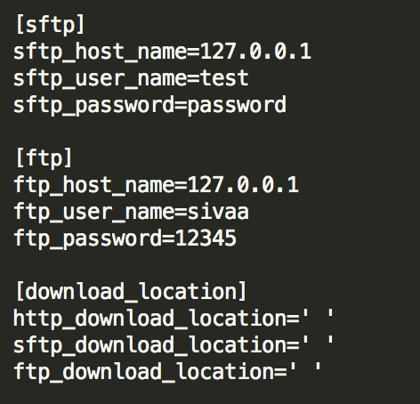

# file_downloader
Determines the protocal from url and downloads file

# Setup:
  * As the first step create ".credentials" inside configuration folder and create a file with name "houston.cfg"
  * Below shows the example of how it should look like, it should have credentials for sftp and ftp server you are trying download
  * You can also add download locations for each protocal.Makse sure its the same name as provided in the example image
  

# How to run:

To start the downloader, run `python initiator.py --url=' '
